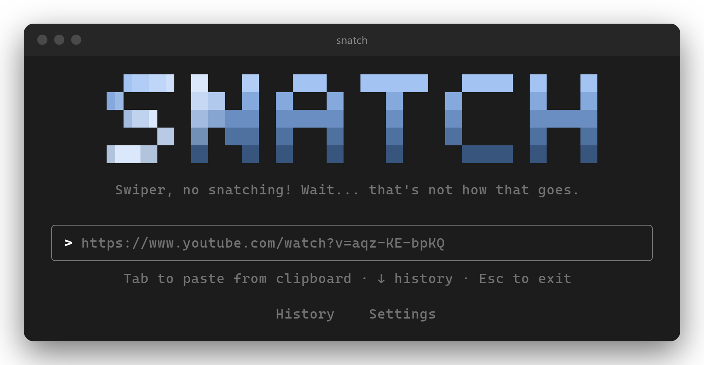
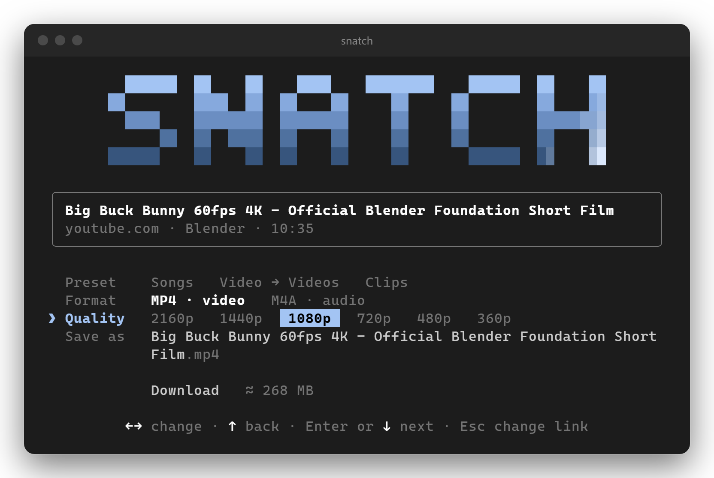
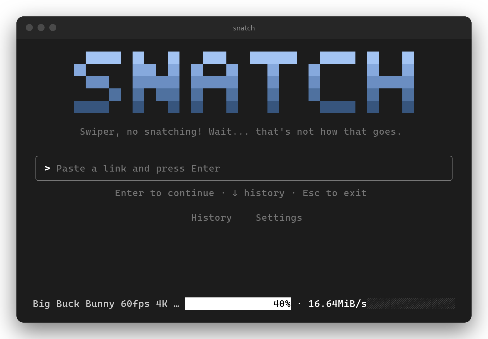
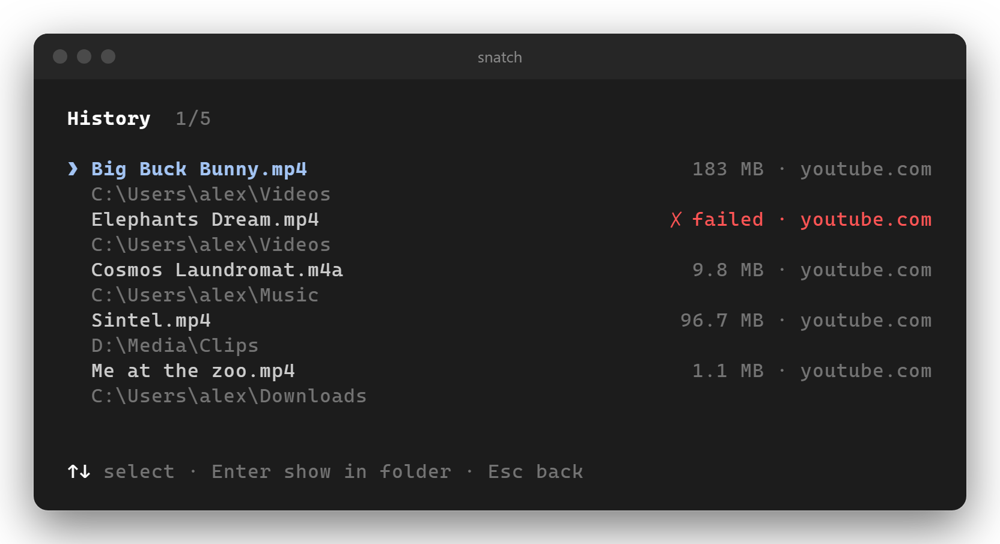
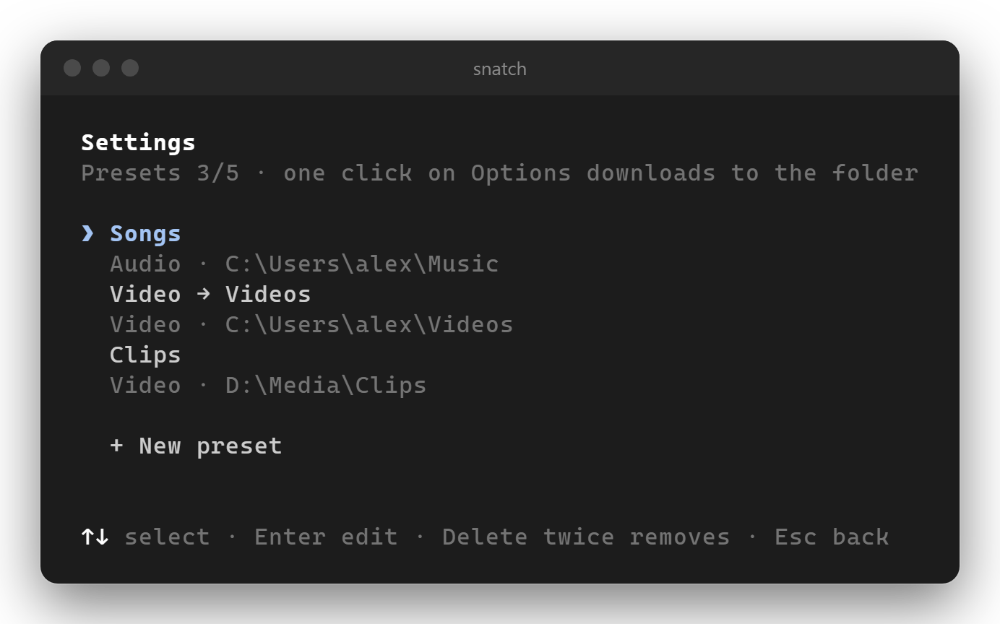

# snatch

Download video or audio from almost any site, from your terminal. Keyboard only, for Windows and macOS.

Inspired by [yoinks](https://github.com/pablostanley/yoinks). Powered by [yt-dlp](https://github.com/yt-dlp/yt-dlp) and [FFmpeg](https://ffmpeg.org).

<p align="center">
  
</p>

## Install

You need Node 20+.

```sh
npm install -g @marlve/snatch
```

Or run it once without installing:

```sh
npx @marlve/snatch
```

snatch needs yt-dlp and FFmpeg. On launch it checks for both, and if one is missing it offers to install it with winget on Windows or [Homebrew](https://brew.sh) on a Mac. To install them yourself:

```sh
winget install yt-dlp.yt-dlp yt-dlp.FFmpeg   # Windows
brew install yt-dlp ffmpeg                   # macOS
```

## Usage

```sh
snatch                # paste a link on the home screen
snatch <link>         # check the link and go straight to the options
snatch setup          # add a Start Menu shortcut (Windows) or Snatch.app in ~/Applications (macOS)
```

Run `snatch setup` from a global install, not from `npx`, so the shortcut points at a copy that stays.

- If your clipboard holds a link, it shows as a suggestion in the empty box. Press `Tab` to use it.
- **Video** saves as MP4, **audio** as M4A. Both use the site's own streams, so nothing is re-encoded.
- **Presets** (Settings) are one-click downloads: a type, a folder and an optional name. Up to 5.
- **History** lists your last 50 downloads and can show a file in Explorer or Finder.
- Everything else saves to your Downloads folder.
- `Esc` goes back. On the home screen, `Esc` twice quits.

## Screenshots

<table>
  <tr>
    <td><br><sub>Options</sub></td>
    <td><br><sub>Download in progress</sub></td>
  </tr>
  <tr>
    <td><br><sub>History</sub></td>
    <td><br><sub>Settings</sub></td>
  </tr>
</table>

## Development

```sh
npm install
npm run dev -- <link>   # run from source
npm run typecheck
npm run build           # compile to dist/
```

## Notes

- Windows and macOS only. macOS support is new, so please open an issue if something misbehaves. The first time you open `Snatch.app`, macOS asks once to let it control Terminal.
- DRM-protected sites (Spotify and similar) are refused by yt-dlp on purpose.

## Fair use

snatch is meant for personal use, like keeping an offline copy of something you're allowed to watch. Be kind to creators, don't redistribute what you download, and remember that what you save is up to you.

## License

[MIT](LICENSE)
